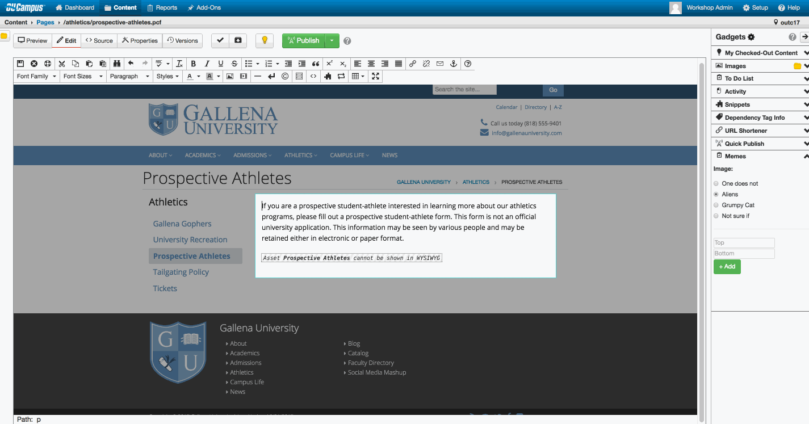

# OUC Memes Gadget

Insert custom memes in to the wysiwyg with a gadget using the imgflip api

Developed for the #OUTC17 hackathon   
(Based on the to do list example from the gadgets workshop - speed over quality)  
Check out the [Gadget starter repo](https://github.com/omniupdate/gadget-starter)

## Getting Started  
- Create an [imgflip account](https://imgflip.com/signup)  
- Add your imgflip credentials to index.html
- Upload to OUC
- Fetch directory from widgets page
- Check the [top 100 templates](https://api.imgflip.com/popular_meme_ids) on imgflip to add more memes
